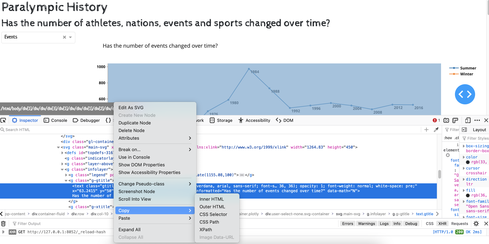

# Lab 5: Testing Dash apps using Selenium

## Set-up

You need to work through the 'Introduction to Testing' activity which explains how to set up your enviornment for Dash.

Specifically you will need to have:

- installed pytest and selenium (in requirements.txt)
- used terminal to `pip install dash[testing]` (this isn't installed used requirements.txt)
- downloaded the correct version of chromedriver for your version of Chrome and your operating system; made sure the
  file can be run (security settings); moved it to a location that is in your 'PATH'

## Task 1: Create a test file for the paralympic app

In the `tests` folder create an appropriately named python file for adding the paralympic tests to.

## Task 2: Create a fixture to create the paralympic app

Consider adding a fixture to `conftest.py`, otherwise you can repeat the code at the start of each test if you prefer.

```python

@pytest.fixture(scope='function')
def run_paralympics_app(dash_duo):
    app = import_app("apps.paralympic_app.paralympic_app")
    yield dash_duo.start_server(app)
```

## Task 3: Write a test to check the home page title

Hint: Look at the first test in `test_recycle_app.py` for guidance as to the test structure.

```python
"""
    GIVEN the app is running
    WHEN the home page is available
    THEN the H1 heading element should include the text 'Paralympic History'
    """
```

Run the test and make sure it runs and passes.

## Task 3: Write more tests

To determine the elements you can test for on a page, first run the app, select an element of the page and then use your
browser's option to view the page source. If you expand on the selection in the Inspector pane, find the element
you are interested in, then right click and there are options to copy aspects such as CSS selector or XPath.


To find an element by xpath you will need to use Selenium locators instead of the dash_duo.find_element e.g.
```python
dash_duo.driver.find_element(By.XPATH, "/html/body/div[1]/div/div/div[3]/div[1]/div/div/h1")
```

Write tests for as many of the following as you can.

```python
"""
GIVEN the Dashboard page has loaded
WHEN the value Athletes is selected from the dropdown with the id 'type-dropdown'
THEN the chart with the id `fig-line-time` should change so that the title includes the words 'participants'
"""

"""
GIVEN the Dashboard page has loaded
WHEN both the Winter and Summer options in the checklist with the id 'mf-ratio-checklist' are unselected
THEN the divs with the ids of 'stacked-bar-gender-win' and 'stacked-bar-gender-sum' should have a `style="display: none"' attribute
"""

"""
GIVEN the Dashboard page has loaded
WHEN the gold medals table is displayed
THEN the text value of the table heading (<th>) in the first column should be 'Country'
"""
```

Find out if it is possible to navigate to one of the locations on the map chart and access the hover information. You
will need to research to see if this is possible. If this is possible then devise an appropriate test for the "where in
the world..." chart.

## Task 4: Run the tests using GitHub Actions

Follow the instructions in 'Introduction to Testing' to set up the workflow in GitHub Actions.

You will need to change the options for the chromedriver so that it runs in headless mode with gpu disabled. Check the
chrome options in `conftest.py`.

Commit and push your tests to GitHub.

Go to the Actions tab in GitHub and check the workflow results.
